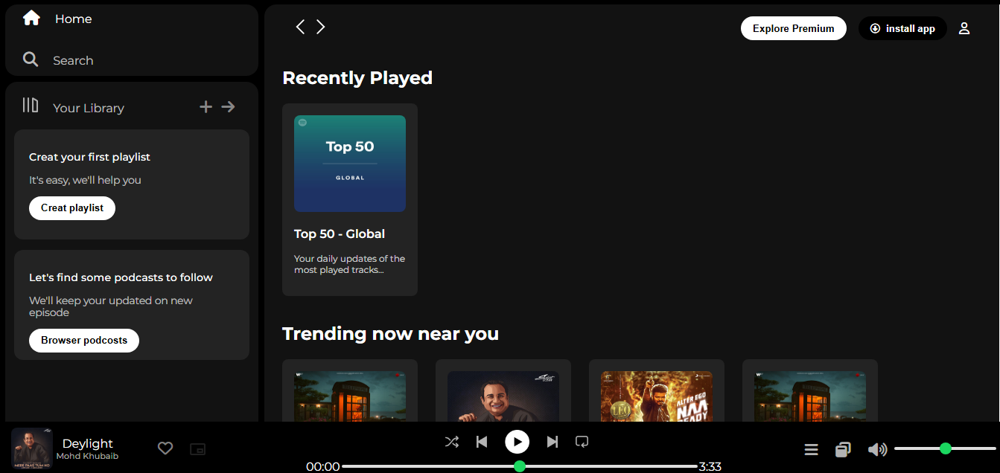
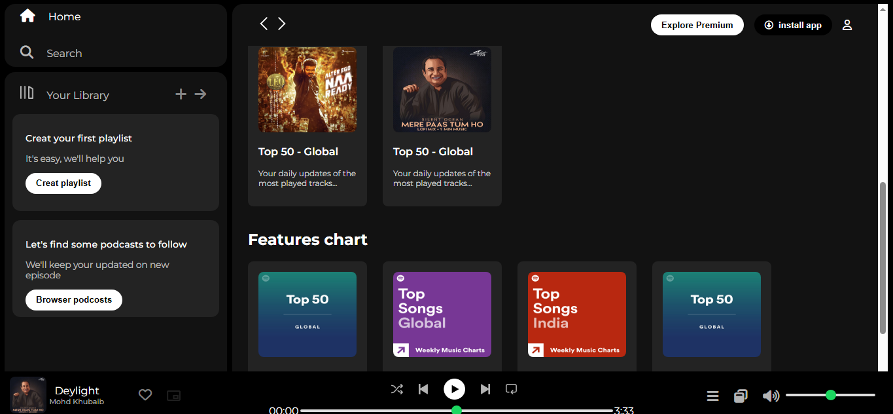

# 🎵 Spotify Clone

A responsive Spotify homepage clone built using HTML, CSS This project mimics the layout and basic functionality of Spotify's user interface for learning and practice purposes.





---

## 🚀 Features

- Responsive homepage design  
- Play/pause controls  
- Playlist layout  
- Custom CSS styling   
- Hover effects and transitions  

---

## 🛠️ Tech Stack

- HTML5  
- CSS3  

---

## 📁 Project Structure

```
spotify-clone/
├── index.html
├── style.css
├── assets/
│   ├── images/
└── README.md
```

---

## 📦 How to Use

1. Clone the repository:
   ```bash
   git clone https://github.com/your-username/spotify-clone.git
   ```
2. Open the project folder:
   ```bash
   cd spotify-clone
   ```
3. Open `index.html` in your browser.

---

## 📸 Screenshots

_Add a screenshot or short demo gif here (optional)_

---

## 🚀 Features (Built Using HTML & CSS Only)

- 🎨 Clean and responsive UI layout
- 📱 Mobile-friendly design using media queries
- 🖼️ Spotify-like homepage structure with sidebar, navbar, and playlist
- 🎵 Playlist cards with song thumbnails and artist names
- ✨ Hover effects and smooth CSS transitions
- 💡 Semantic HTML elements for better structure

---

## 🔮 Future Improvements

- 🔍 Add search functionality using JavaScript
- 🧠 Make playlist functional (play/pause) with JavaScript
- 🎧 Add actual audio player integration
- 🔄 Improve interactivity with JavaScript events
- ⚙️ Add backend (Node.js + Express + MongoDB) for dynamic content


---

## 📄 License

This project is for educational purposes only. All rights to Spotify’s brand, logo, and assets belong to Spotify.

---

## 🙌 Acknowledgements

- Inspired by [Spotify](https://spotify.com)  
- UI based on Spotify Web Player
